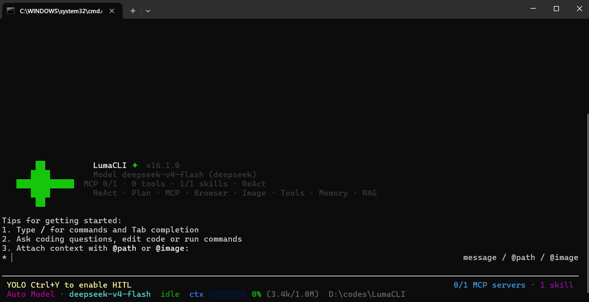
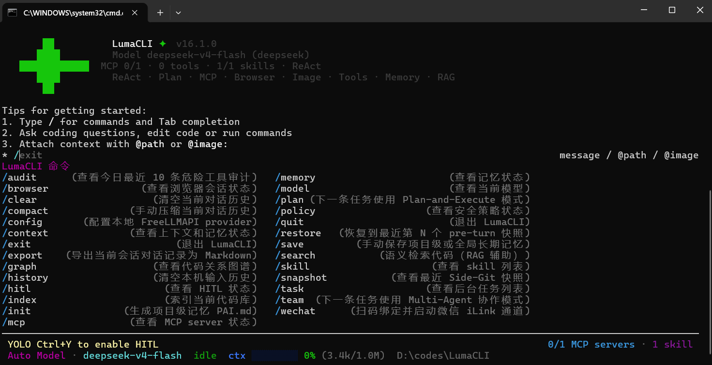

# LumaCLI

对标 Claude Code 的 Java Agent CLI 产品，支持 ReAct、Plan-and-Execute、Multi-Agent 三种执行模式，集成 MCP 协议、Skill 技能系统、浏览器自动化、微信通道等能力。



## 技术栈

- **语言**: Java 17
- **构建**: Maven
- **终端交互**: JLine 4
- **持久化**: SQLite（向量存储、任务队列、代码图谱）
- **HTTP**: OkHttp
- **JSON**: Jackson
- **AST 解析**: JavaParser
- **本地 Embedding**: Ollama (nomic-embed-text)

## 核心功能

### 三种执行模式
- **ReAct**: 单轮对话驱动的思考-行动-观察循环，适合简单任务
- **Plan-and-Execute**: 任务拆解 → 依赖排序 → 按序执行，适合多步骤复杂任务
- **Multi-Agent**: 规划者 + 执行者 + 检查者协作，审查未通过自动重试


### 多模型支持
- GLM-5.1 / GLM-5V-Turbo（智谱）
- DeepSeek V4
- 阶跃星辰 StepFun
- Kimi K2.6
- 讯飞星辰 MaaS
- FreeLLMAPI（本地 OpenAI 兼容网关）
- Agnes 2.0 Flash
- 运行时 `/model <name>` 切换

### MCP 协议
- 支持 stdio 子进程 server 与 Streamable HTTP 远程 server
- 默认集成 Chrome DevTools MCP，支持浏览器自动化
- MCP 工具自动注册为 `mcp__{server}__{tool}`
- 支持 resources 引用（`@server:protocol://path`）

### Skill 技能系统
- YAML Frontmatter + Markdown 声明式技能定义
- 三级渐进式加载（摘要 → 详情 → 引用文档）
- 内置 web-access skill（浏览器访问决策手册）

### 记忆系统
- 短期记忆：当前对话与工具结果
- 长期记忆：`/save <事实>` 保存关键事实，跨会话复用
- 项目级记忆：`PAI.md` 团队规则，`PAI.local.md` 本地覆盖
- 对话接近预算时自动摘要压缩

### 代码理解
- 代码向量化 + SQLite 持久化 + 余弦相似度语义检索
- 代码分块（文件/类/方法粒度）与 AST 解析
- 代码关系图谱（extends/implements/imports/calls）

### 安全机制
- HITL 危险操作人工审批（`/hitl on`）
- PathGuard 路径围栏（文件操作限定项目根内）
- CommandGuard 命令黑名单（sudo/rm -rf/mkfs 等）
- 结构化审计日志（`~/.lumacli/audit/`）

### 微信通道
- iLink 长轮询收发消息
- `lumacli wechat setup` 扫码绑定
- 非交互式安全策略：只读允许，写入/执行需白名单

## 快速开始

### 环境要求
- Java 17+
- Maven 3.8+
- Ollama（可选，用于本地 Embedding）

### 配置 API Key
```bash
cp .env.example .env
# 编辑 .env，填入 API Key（至少一个）
```

支持的环境变量：
- `DEEPSEEK_API_KEY` - DeepSeek
- `GLM_API_KEY` - 智谱 GLM
- `STEP_API_KEY` + `STEP_MODEL` - 阶跃星辰
- `KIMI_API_KEY` + `KIMI_MODEL` - Kimi
- `XFYUN_MAAS_API_KEY` - 讯飞星辰 MaaS
- `AGNES_API_KEY` + `AGNES_MODEL` + `AGNES_BASE_URL` - Agnes

### 一键启动（Windows）
```bash
# 首次编译
build.cmd

# 启动（自动配置 JAVA_HOME 和编码）
run.cmd
```

`run.cmd` 内置 Java 环境隔离，不影响系统全局 `JAVA_HOME`，双击即可运行。

### 手动编译运行
```bash
mvn clean package
java -jar target/lumacli-1.0-SNAPSHOT.jar
```

### 常用命令
```bash
/plan <任务>          # Plan-and-Execute 模式
/team <任务>          # Multi-Agent 协作模式
/model <name>         # 切换模型
/config               # 打开配置面板
/mcp                  # 查看 MCP server 状态
/browser connect      # 连接 Chrome 复用登录态
/wechat               # 启动微信通道
/skill list           # 查看技能列表
/memory               # 查看记忆状态
/save <事实>          # 保存长期记忆
/hitl on|off          # 开关危险操作审批
/index                # 索引代码库
/search <查询>        # 语义检索代码
/compact              # 压缩对话历史
/clear                # 清空对话
/export               # 导出会话为 Markdown
/exit                 # 退出
```



## 项目结构

```
src/main/java/com/lumacli/
├── agent/                    # Agent 核心（ReAct / Plan-and-Execute / Multi-Agent）
├── cli/                      # CLI 入口、命令解析、Tab 补全、语法高亮
├── llm/                      # 多模型客户端（GLM / DeepSeek / Step / Kimi / Xfyun / Agnes）
├── memory/                   # 短期 + 长期记忆、对话压缩、Token 预算
├── rag/                      # RAG 代码向量检索（SQLite + 余弦相似度）
├── mcp/                      # MCP 协议（stdio / Streamable HTTP / resources / @mention）
├── skill/                    # Skill 技能系统（YAML + Markdown 声明式）
├── policy/                   # 安全策略（PathGuard / CommandGuard / AuditLog）
├── snapshot/                 # Side-Git 快照与回滚（JGit）
├── runtime/                  # 后台任务队列 + HTTP Runtime API
├── web/                      # Web 搜索与抓取
├── browser/                  # Chrome DevTools Protocol 集成
├── wechat/                   # 微信 iLink 通道
├── render/                   # 渲染器（inline / lanterna / plain）
├── image/                    # 图片输入与剪贴板支持
├── lsp/                      # LSP 诊断注入
├── config/                   # 配置管理
├── context/                  # 上下文管理
└── tool/                     # 工具注册表
```

## 许可证

MIT License
